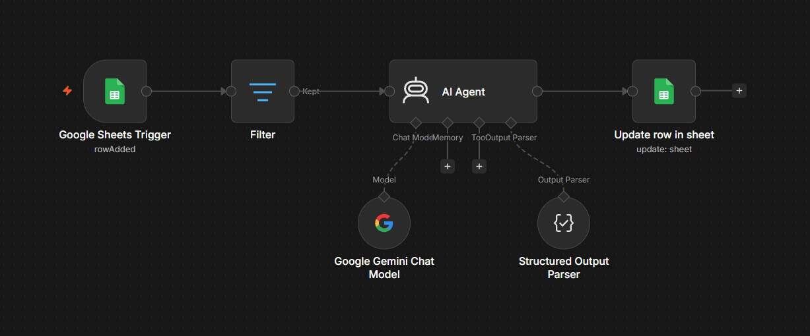
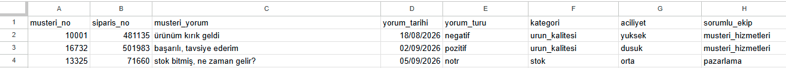

# 🤖 Müşteri Geri Bildirim AI Agent (n8n & Gemini 3.5)

Bu proje; Google Sheets tablosuna yeni eklenen e-ticaret müşteri yorumlarını gerçek zamanlı (real-time) algılayan, Google Gemini LLM ve Structured Output Parser kullanarak yorumları analiz eden ve sonuçları otomatik güncelleyen bir otomasyon sistemidir.

## 🚀 Öne Çıkan Özellikler

- **Google Sheets Trigger:** Tabloya yeni satır/yorum eklendiğinde otomatik tetiklenme.
- **Akıllı Filtreleme (Token Optimization):** Sadece işlenmemiş (boş) satırları analiz eder, gereksiz API harcamasını engeller.
- **AI Agent & Prompt Engineering:** Türkçe müşteri yorumlarını duygu (pozitif/negatif/nötr), kategori (ürün kalitesi, kargo, stok vb.), aciliyet seviyesi ve ilgili departmana göre sınıflandırır.
- **Structured Output Parsing:** LLM çıktısını kesin JSON şemasına (Enum) zorlayarak hatalı format riskini sıfıra indirir.

## 📊 Canlı Demo

- **Google Sheets Örneği:** [Canlı Tabloyu Görüntüle](https://docs.google.com/spreadsheets/d/1DCxp1ssaVlI52tZBx9a2QgG2gbBEGiXt1s7CiT4Lrxg/edit?usp=sharing)

## 📸 Workflow & Canlı Çıktı

### n8n Mimari Akışı

### Analiz Edilmiş Google Sheets Tablosu

## 🛠 Kullanılan Teknolojiler

- **n8n** (Workflow Automation)
- **Google Gemini 3.5 Flash / Pro API**
- **Google Sheets API**
- **JSON Schema / Enum Types**

## 📌 Kurulum

1. Bu depodaki `customer_feedback_assistant.json` workflow dosyasını indirin.
2. n8n panelinizde **Import from File** seçeneği ile akışı içeri aktarın.
3. Kendi Google Sheets ve Gemini API bağlantılarınızı (Credentials) tanımlayın.
4. Akışı **Active** konuma getirin.
